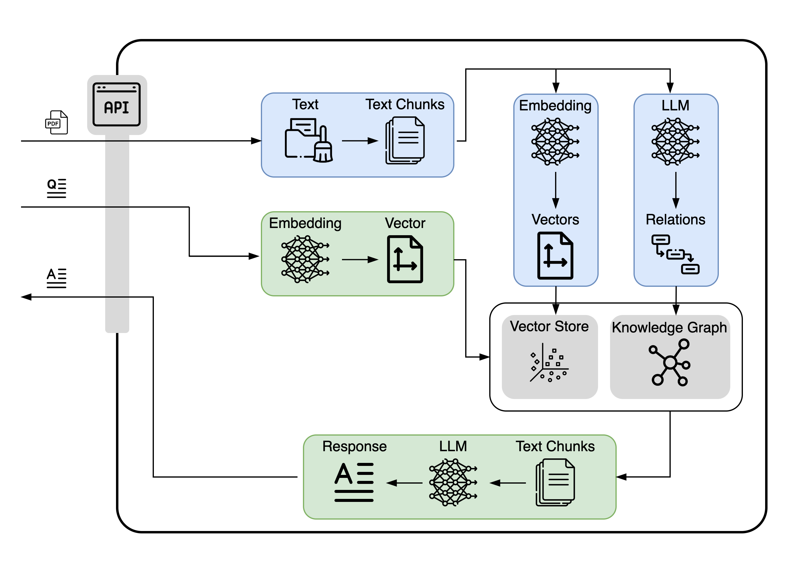
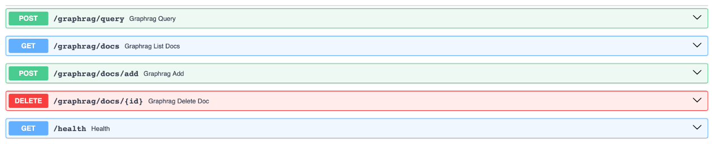

# GraphRAG using Neo4j
A project developed for HKUST COMP4651 by Group 6: Paul Bauer, Andreas Wager, Sophie Dinh, and Mathys Muganga.  
The full repository is available on [GitHub](https://github.com/regawan/comp4651-graphrag-project).

## System Overview


## Prerequisites
- AWS EC2 instance (Ubuntu, t3.medium recommended)
- SSH key (.pem file)
- Vertex AI service account JSON in secrets/vertex-ai-service-account.json
- .env file with environment variables

## Setup

### AWS
1. Connect to EC2
`ssh -i "/path/to/aws-key.pem" ubuntu@<EC2_PUBLIC_IP>`

2. Install Docker & Docker Compose on EC2
```
sudo apt-get update
sudo apt-get install -y docker.io docker-compose
sudo usermod -aG docker ubuntu
```
Note: Log out and back in for group changes to take effect.


### Run with docker
1. Clone this repository.
2. Download the secret files `.env` and `plexiform-notch-478113-d0-0c739ffa1a72.json` from our
   secure file storage and add them to the highest project level.
3. Open the `docker-compose.yml` file and adjust the volume definition to point to the secret `.json` file
   ```
   volumes:
      - <INSERT ABSOLUTE PATH TO JSON>:/secrets/vertex-ai-service-account.json:ro
   ```
4. Build the container: `docker compose build`
5. Start the container: `docker compose up`
6. Open `localhost:8000/docs` in your browser to discover the swagger UI (showcasing all endpoints)
7. After running stop the container: `docker compose stop`


## Usage
Start the container as described in the setup section and open `localhost:8000/docs` in your browser
to access the SwaggerUI. Note: all endpoints listed in the SwaggerUI can be accessed via HTTP requests
from any browser or tools like Postman.

### Document Management
- **List Documents**: Simply run the request `GET /graphrag/docs` in the SwaggerUI or open `localhost:8000/graphrag/docs`
  in your browser to get a list with all indexed documents. The result looks like:
   ```
  {
    "docs": [
      {
        "document_id": "biomolecules-11-00928-v2-trunc.pdf",
        "chunks": 12
      },
      {
        "document_id": "GAP-between-patients-and-clinicians_2023_Best-Practice-trunc.pdf",
        "chunks": 11
      }
    ]
  }
   ```
- **Add new documents**: Open the `POST /graphrag/docs/add` endpoint in the SwaggerUI, select or drag&drop a file into the
  file selector filed and run the post request. The process of adding files is computational intensive and can take
  some time! The response should look like this:
   ```
  {
    "status": "ok",
    "ingested": [
      "biomolecules-11-00928-v2-trunc.pdf"
    ]
  }
  ```
  and the added file should be visible in the list documents response.
- **Remove a document**: Open the `DELETE /graphrag/docs/{id}` endpoint, insert the id of the document that should be
  removed and send the request. The response should look like:
  ```
  {
    "status": "deleted",
    "document_id": "biomolecules-11-00928-v2-trunc.pdf"
  }
  ```
  The deletion can be verified by rerunning the list documents endpoint.


### Information Retrieval
- **Query Information**: Open the `POST /graphrag/query` endpoint, add a question string and additionally adjust the
  top-k parameter to refine your search. The response has the format:
  ```
  {
  "answer": "string"
  }
  ```


### API Endpoints Overview
